# Virtual Reality Maze
## Authors

* Carlos Domínguez García [carlosdg](https://github.com/carlosdg)
* Daute Rodríguez Rodríguez [DauteRR](https://github.com/DauteRR)

## Description

As every video game, the main goal is the players entertainment. In our game, the player have to scape from procedurally generated mazes with enemies. The player can shoot and use consumables to ease the fights and complete the mazes. Besides, we have included a day night cycle to difficult the players objective.

### Scenes
The game is conformed by two scenes:
* Main menu scene: The player can start a new game (sucession of mazes), talk with a chatbot to resolve doubts and see the stats.

    

* Maze scene: The player have to survive and reach the final point of the maze.  

    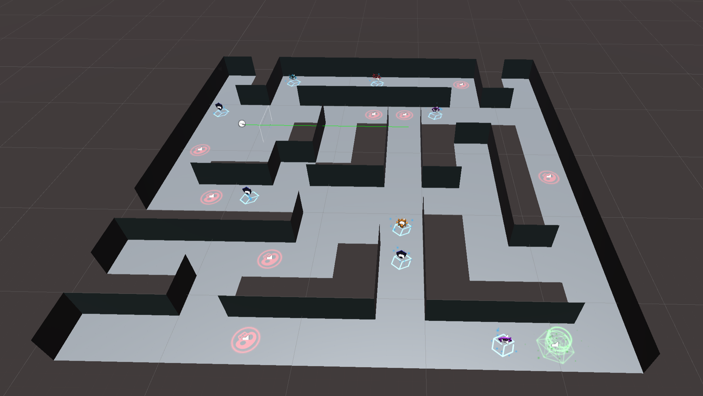

    

    

When the player solves a maze the main menu changes its appearance to note the player the possibility of continue the game and its stats are updated:

    

## Virtual reality recommendations

Virtual reality recommendations that we have followed are:
* The user has total control of the player movement inside the game
* Use of a reticle as a visual aid
* Constant velocity of the player movements
* Included visual effects and sounds
* The distance between the player and the user interfaces is optimal (3m)

## Use considerations

To be able to play you will need a PlayStation 4 controller or change the required buttons on unity.

| Botón 	| PC 	                | Mobile 	                |
|:------:	|:--:	                |--------	                |
|square   	| joystick button 0    	|   joystick button 0     	|
|   x     	| joystick button 1  	|   joystick button 1    	|
|  circle   | joystick button 2  	|   joystick button 13     	|
|triangle   | joystick button 3   	|   joystick button 2     	|
|    L1    	| joystick button 4 	|   joystick button 3     	|
|    R1  	| joystick button 5    	|   joystick button 14     	|
|    L2    	| joystick button 6    	|   joystick button 4     	|
|    R2    	| joystick button 7    	|   joystick button 5     	|
|    share  | joystick button 8    	|   joystick button 6     	|
|    options| joystick button 9    	|   joystick button 7     	|
|     L3   	| joystick button 10    |   joystick button 11     	|
|     R3   	| joystick button 11    |   joystick button 10     	|
|     PS   	| joystick button 12    |   joystick button 12     	|
|     PAD   | joystick button 13    |   joystick button 8     	|

## Player

### Player state

* Health (100 units on start)
* Nivel de escudo (0 units on start)
* Weapon (shots that inflict 20 units of damage to enemies)
* Lantern (20 second of battery on start)

    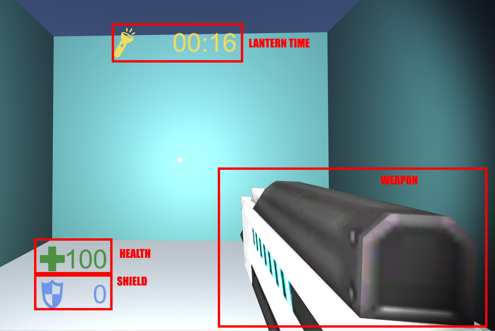

When the player dies (health reaches 0), the main menu returns to its initial layout, if the player starts a new game the stats are resetted.

During the last seconds of lantern battery, the light will flash on an intermittent way

    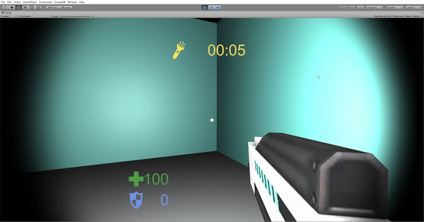

### Controls

| Action                     | Buttons        | Gif                                                                                     |
| :------:	                 | :--:           | :---:                                                                                   |
| Movement                   | Left joystick  | 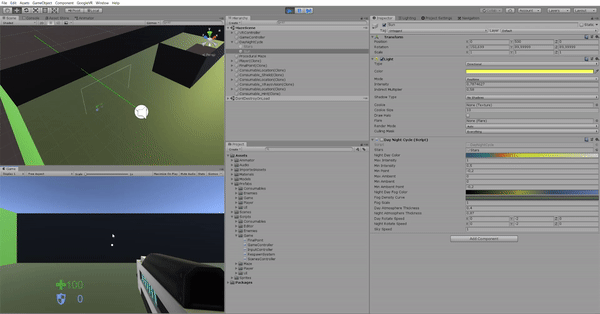                        |
| Rotation                   | L2, R2         | 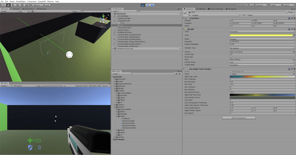                    |
| UI elements interactions   | x              | 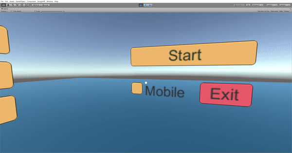   |
| Game elements interactions | square         | 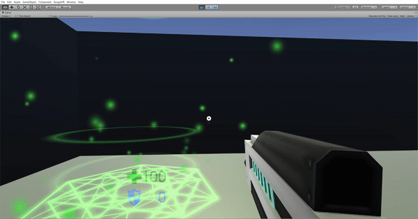 |
| Exit maze                  | PS             | 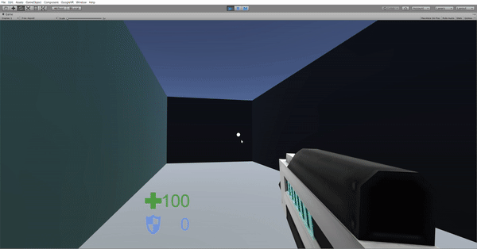                 |
| Shoot                      | R1             | 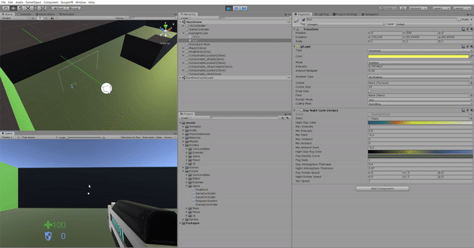                    |
| Lantern                    | L3             | 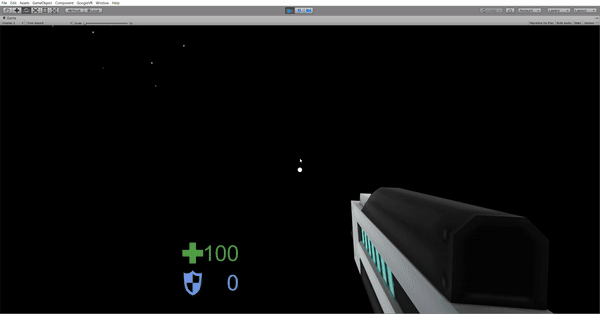                |

## Enemies

There are three types of enemies:

|    Type     | Damage | Health  | Speed     | Abilities                                        |
|  :------:	  | :--:   | :---:   |   :---:   | :---:                                            |
|  Mouse   	  |  15    |   80    |    2.2    | Hearing System (7m)                              |
|  Skeleton   |  20    |  100    |    1.7    | Vision System (7m, 140°)                         |
|  Knight     |  30    |  150    |    1.3    | Hearing System (5m) and Vision System (5m, 110°) |

    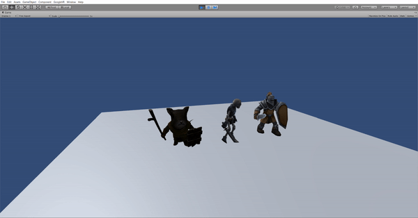

The enemies appears at specific positions (enemy respawns) after 5 to 15 seconds.

    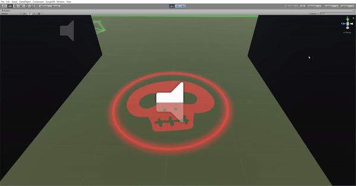

These positions can been deactivated by the player with the square button, when they are deactivated the enemies can't respawn. The respawns remain deactivated between 10 and 30 seconds.

    

### Enemy states

| State     | Gif                                                                  |
| :------:  | :---:                                                                |
| Idle      | 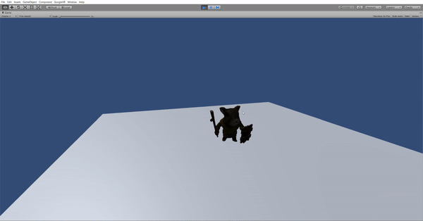      |
| Walking   |    |
| Attacking | 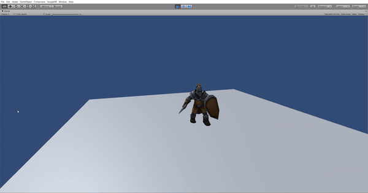 |
| Dead      | 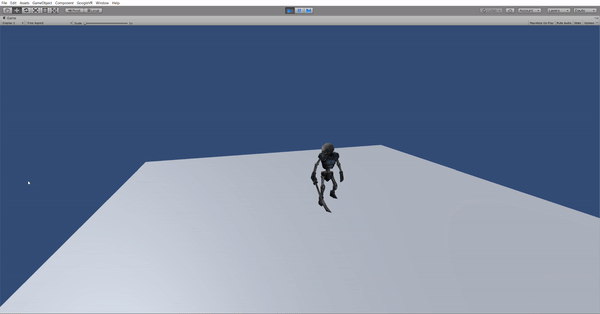     |

### Vision system

The enemies are able to see within a certain angle and a maximum distance. To achieve that we used physics raycasting to determine if the player is in the field of view of the enemy without obstacles between them.

    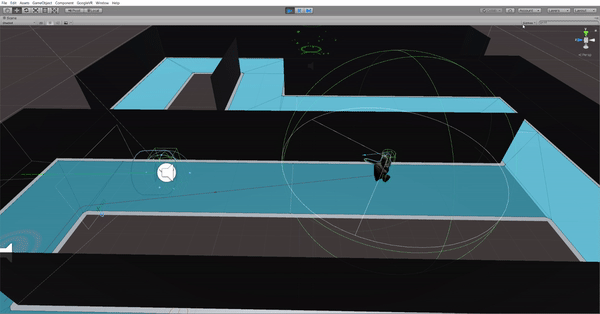

### Hearing system

When the player makes a noise, a sphere collider increases its radius representing the distance that the noise travels. The enemies has also a sphere collider that represents its hearing capacity. When these two colliders collides, the enemy detects the player.

#### Player actions that makes noises

* Walking
* Shooting
* Turning on/off the lantern

    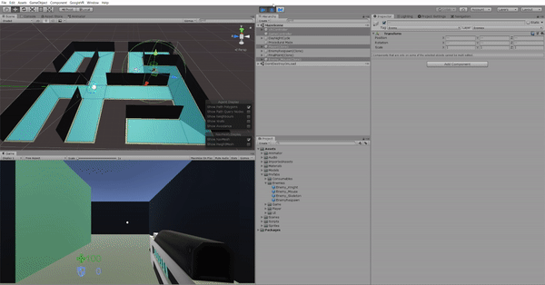

## Consumables

Consumables are pickable objects that aid the player, you can find them at some specific points of the generated mazes (consumable locations), they respawn every 20 to 60 seconds.

    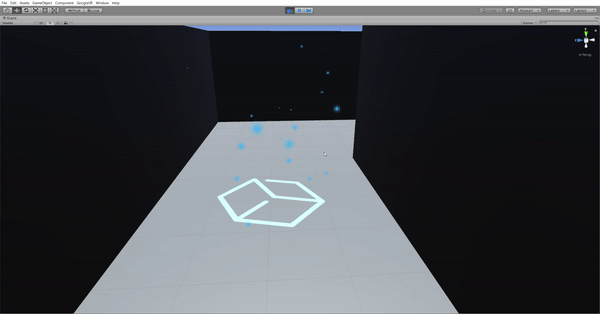

| Type             | Effect                                                               | Gif |
| :---:            | :------:                                                             | :--:|
| Health           | Increases player's health in 25 units instantly                      | 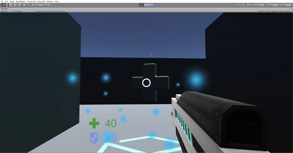          |
| Shield           | Increases player's shield in 20 units instantly                      |           |
| Battery          | Increases lantern's battery in 20 seconds instantly                  | 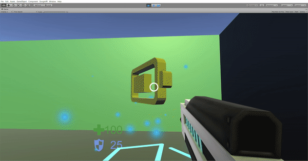         |
| Increase damage  | Increases shots damage in 10 units during 15 seconds                 |   |
| Inaudible player | The enemies can't hear the player during 20 seconds                  |  |
| Invisible player | The enemies can't see the player during 20 seconds                   | 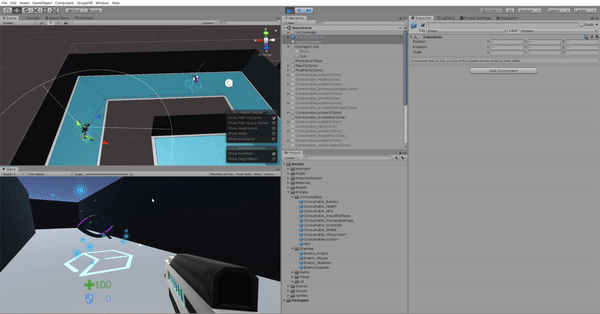 |
| Hint             | Shows a visual hint in the final point of the maze during 10 seconds |             |
| X rays vision    | Turns the maze walls transparent during 10 seconds                   |      |

## Physics

| Game object          | Collider type                        |
| :----:               | :------                              |
| Maze                 | Static collider                      |
| Player body          | Kinematic Rigidbody Trigger Collider |
| Player noise sphere  | Kinematic Rigidbody Trigger Collider |
| Shots                | Rigidbody Trigger Collider           |
| Enemy body           | Kinematic Rigidbody Collider         |
| Enemy weapon         | Kinematic Rigidbody Trigger Collider |
| Enemy hearing sphere | Kinematic Rigidbody Trigger Collider |

## Issues during the development

### Difficulties
* Colaboratory work with unity
* Lack of free assets
* Complexity of unity
* Lack of time
* Lack of hardware (cardboard and ps4 controller)

### Solutions
* Using the scripting documentation
* Using tutorials
* Reading posts of people with similar problems
* Creating our own consumables models, particle systems, materials ...

## Tasks distribution:
* Maze generation: Daute
* Consumables: Carlos y Daute
    * Scripting: Carlos
    * Modeling: Daute
* Day night cycle: Carlos
* Damage detection: Daute
* Assets search: Carlos
* Player controller development: Daute
* Spawn system: Carlos y Daute
    * Spawn system development: Carlos
    * Enemy respawn and consumable location development: Daute
* Enemies hearing system and vision system development: Carlos
* Enemy controller development: Daute
* Chatbot creation: Carlos
* User interfaces creation: Carlos

## External assets
* GoogleVR: needed for VR compatibility
* ApiAiSDK: needed for the chatbot creatiom
* NavMeshComponents: needed for enemies movements
* DayNightCycle
* Skeleton enemy
* Knight enemy
* Mouse enemy
* Robot model
* Shield consumable model
* Shots materials
* Player weapon model

## Execution

    

    

    

## References
* [VR Player Movement](https://www.youtube.com/watch?v=UBowqGbZ9a4&feature=youtu.be)
* [Procedural generation of mazes](https://www.youtube.com/watch?v=gXpi1czz5NA)
* [Enemy wandering system](https://www.youtube.com/watch?v=gXpi1czz5NA)
* [PS4 controller map for Unity](https://www.youtube.com/watch?v=gXpi1czz5NA)
* [Enemy vision system](https://www.youtube.com/watch?v=gXpi1czz5NA)
* [How to make a spoon in Blender](https://www.youtube.com/watch?v=unTHnOnvvZY)
* [Basic AI](https://www.youtube.com/watch?v=gXpi1czz5NA)
* [Game effects with particle systems](https://www.youtube.com/watch?v=iMcGkgP0P-M)
* [Unity Scripting API](https://docs.unity3d.com/ScriptReference/)
